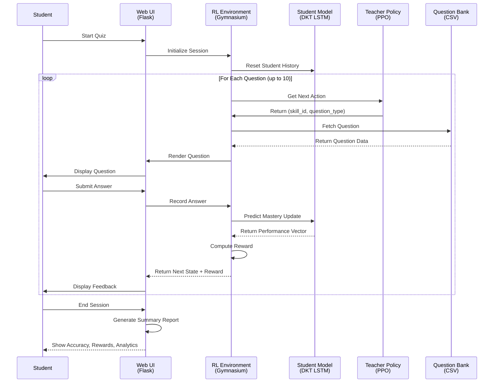

# Personalized Learning RL: Complete Architecture & Design Documentation

> **Comprehensive guide to the AI-powered adaptive learning system combining Deep Knowledge Tracing with Reinforcement Learning for personalized education.**

---

## 📋 Table of Contents

1. [Executive Summary](#executive-summary)
2. [Problem Statement & Vision](#problem-statement--vision)
3. [System Architecture](#system-architecture)
4. [Data Pipeline & Collection](#data-pipeline--collection)
5. [Core Components](#core-components)
6. [Algorithm Details](#algorithm-details)
7. [Resource Requirements](#resource-requirements)
8. [Benefits & Impact](#benefits--impact)
9. [Design Decisions](#design-decisions)
10. [Future Roadmap](#future-roadmap)

---

## Executive Summary

This project implements an **end-to-end adaptive learning platform** that intelligently selects the next-best question for each student based on their learning history and current mastery levels.

### Key Innovation
```
Traditional Education        →    AI-Powered Adaptive Learning
├─ Same questions for all   →    ├─ Questions tailored per student
├─ Fixed pace             →    ├─ Student-paced progression
├─ Reactive feedback      →    └─ Predictive guidance
└─ No skill gap analysis  →       └─ Targeted weak skill improvement
```

### Core Technologies Stack
| Layer | Technology | Purpose |
|-------|-----------|---------|
| **AI/ML** | LSTM + DKT | Student knowledge prediction |
| **RL** | PPO (Proximal Policy Optimization) | Teacher curriculum policy |
| **Environment** | Gymnasium + Flask | Interactive learning simulation & UI |
| **Data** | Pandas + Scikit-learn | Question bank & analytics |
| **Inference** | TensorFlow/Keras | Real-time mastery prediction |

---

## Problem Statement & Vision

### The Challenge
Modern education faces **three critical problems:**

1. **Information Overload** – Students struggle to identify which topics need focus
2. **Inefficient Pace** – Fixed curricula don't adapt to individual learner speeds
3. **Knowledge Gaps** – Traditional assessments miss emerging skill deficits

### Our Vision
> *Create a system where every student receives a **personalized curriculum** that adapts in real-time, targeting their weakest skills while reinforcing strengths.*

### Solution Design
- **What We Thought:**  
  Use reinforcement learning to train a "teacher agent" that learns to select questions optimally—similar to how human tutors adapt their teaching strategies.

- **How We Did It:**  
  1. Built a student knowledge model (DKT) from historical interaction data
  2. Wrapped it in an RL environment that simulates teaching outcomes
  3. Trained a PPO agent to maximize three simultaneous objectives:
     - Student mastery improvement
     - Coverage of weak skills
     - Question answerability to current ability

---

## System Architecture

### High-Level System Diagram

```mermaid
graph TB
    subgraph Input["📥 Input Layer"]
        QBank["Question Bank<br/>(1000+ questions)"]
        SkillTax["Skill Taxonomy<br/>(174 skills)"]
        StudentData["Historical Data<br/>(student interactions)"]
    end
    
    subgraph PreProc["🔄 Pre-Processing"]
        DataClean["Data Cleaning<br/>&amp; Normalization"]
        QEmbed["Question Embedding<br/>(SBERT)"]
        SkillEmbed["Skill Embedding<br/>(SBERT)"]
    end
    
    subgraph Training["🎓 Training Phase"]
        DKTTrain["DKT Model Training<br/>(LSTM-based)"]
        RLTrain["PPO Policy Training<br/>(Curriculum Learning)"]
    end
    
    subgraph Models["🧠 Trained Models"]
        DKTModel["Student Model<br/>dkt_model_working.keras"]
        RLPolicy["Teacher Policy<br/>ppo_policy.zip"]
    end
    
    subgraph Inference["⚡ Inference/Runtime"]
        Env["QuestionSelectionEnv<br/>(Gymnasium)"]
        API["Flask REST API"]
    end
    
    subgraph Output["📊 Output Layer"]
        UI["Web Quiz Interface"]
        Logs["Session History &amp; Analytics"]
        Dashboard["Learner Dashboard"]
    end
    
    Input --&gt; PreProc
    PreProc --&gt; Training
    Training --&gt; Models
    Models --&gt; Inference
    Inference --&gt; Output
    
    style Input fill:#e1f5ff
    style PreProc fill:#fff3e0
    style Training fill:#f3e5f5
    style Models fill:#e8f5e9
    style Inference fill:#fce4ec
    style Output fill:#e0f2f1
```

---

### Component Interaction Diagram



---

## Data Pipeline & Collection

### Complete Data Flow Architecture

```mermaid
graph LR
    subgraph RawData["🗂️ Raw Data Sources"]
        A1["Assistments Dataset<br/>(1M+ Interactions)"]
        A2["Question Bank<br/>(1000+ items)"]
        A3["Curriculum Standards<br/>(174 skills)"]
    end
    
    subgraph Extraction["🔍 Extraction & Parsing"]
        E1["CSV Parsing"]
        E2["Skill Mapping"]
        E3["Difficulty Classification"]
    end
    
    subgraph Cleaning["🧹 Data Cleaning"]
        C1["Handle Missing Values"]
        C2["Remove Duplicates"]
        C3["Normalize Skill Names"]
        C4["Validate Question Format"]
    end
    
    subgraph Embedding["🧬 Embedding & Encoding"]
        EB1["Question Text → SBERT"]
        EB2["Skill Names → SBERT"]
        EB3["Question Types Encoded"]
        EB4["Difficulty Levels Normalized"]
    end
    
    subgraph Features["⚙️ Feature Engineering"]
        F1["Student Interaction Sequences"]
        F2["Skill-Question Relationships"]
        F3["Temporal Patterns"]
        F4["Performance Metrics"]
    end
    
    subgraph Storage["💾 Data Storage"]
        S1["questions.csv"]
        S2["cleaned_df.csv"]
        S3["curriculum_skills.json"]
        S4["Embeddings Cache"]
    end
    
    RawData --&gt; Extraction
    Extraction --&gt; Cleaning
    Cleaning --&gt; Embedding
    Embedding --&gt; Features
    Features --&gt; Storage
    
    style RawData fill:#ffebee
    style Extraction fill:#fff3e0
    style Cleaning fill:#f3e5f5
    style Embedding fill:#e1f5fe
    style Features fill:#e8f5e9
    style Storage fill:#f1f8e9
```

### Data Specification

#### Question Bank Schema (`data/questions.csv`)
```csv
id,question_text,answer,skill,difficulty,question_type,choices
1,What is 2+2?,4,Addition Whole Numbers,easy,fill_in_one,
2,Which is 2+2?,4,Addition Whole Numbers,easy,multiple_choice,3|4|5|6
3,Solve for x: 2x+3=7,x=2,Algebraic Solving,medium,algebra,
```

**Columns:**
- `id` – Unique question identifier
- `question_text` – Full question prompt
- `answer` – Expected/correct answer
- `skill` – Primary mathematical skill tested (1 of 174)
- `difficulty` – Level: `easy|medium|hard`
- `question_type` – Modality: `fill_in_one|multiple_choice|algebra`
- `choices` – Pipe-separated options for MC questions

#### Cleaned Interaction Data (`data/cleaned_df.csv`)
Schema for training DKT:
```
student_id,question_id,skill_id,is_correct,timestamp,sequence_number
123,456,42,1,2024-01-15 14:23:00,1
123,789,42,0,2024-01-15 14:24:30,2
...
```

#### Curriculum Skills (`curriculum_skills.json`)
```json
[
  "Absolute Value",
  "Addition Whole Numbers",
  "Algebraic Simplification",
  ...
  (174 total unique skills)
]
```

---

## Core Components

### 1. Deep Knowledge Tracing (DKT) Model

**Architecture:**
```
Input Layer (100 features)
    ↓
LSTM Layer 1 (128 hidden units)
    ↓
Dropout (0.5)
    ↓
LSTM Layer 2 (64 hidden units)
    ↓
Dropout (0.5)
    ↓
Dense Layer (1 output: mastery score)
    ↓
Output: [0, 1] ∈ ℝ (predicted mastery)
```

**Key Parameters:**
- Input encoding: 100-dim one-hot vectors
- Sequence length: max 50 timesteps
- Total parameters: 166,721
- Framework: TensorFlow/Keras

**What It Does:**
- Takes a sequence of student interactions: `[(skill_1, answer_1), (skill_2, answer_2), ...]`
- Predicts overall student mastery level (continuous value 0–1)
- Enables the environment to assess whether the student can answer the next question

**Usage Example:**
```python
# Load model
dkt_model = tf.keras.models.load_model("models/dkt_model_working.keras")

# Encode history: [skill_id, answer_correctness, question_type]
history = [(5, 1, 0), (5, 0, 1), (7, 1, 0)]
X = encode_and_pad(history, max_len=50)  # Shape: (1, 50, 100)

# Predict mastery
mastery = dkt_model.predict(X)  # Shape: (1, 1), value ∈ [0, 1]
```

---

### 2. Question Selection Environment (Gymnasium)

**Class:** `QuestionSelectionEnv` (in `environment/question_selection_env_main.py`)

**Action Space:**
```
MultiDiscrete([174, 3])
  ├─ skill_id ∈ [0, 173]  (which skill to test)
  └─ question_type ∈ [0, 2]  (question modality)
```

**Observation Space:**
```
Box([0, 1], shape=(174,))  ← Current student mastery per skill
```

**Reward Function:**
```
R = w_improvement × Δmastery 
  + w_answerability × (1 - |student_level - question_difficulty|)
  + w_coverage × (1 if selecting weak skill else 0)

where:
  w_improvement = 100
  w_answerability = 50
  w_coverage = 0.5
```

**Step Process:**
1. Agent selects `(skill_id, question_type)`
2. Environment:
   - Samples a question matching skill & type
   - Uses DKT to predict student's ability
   - Evaluates question answerability
   - Checks if skill is in bottom 40% (weak)
3. Returns: `(obs, reward, terminated, truncated, info)`

---

### 3. PPO Teacher Policy

**Algorithm:** Proximal Policy Optimization (Stable-Baselines3)

**Training Setup:**
```python
PPO(
    policy="MlpPolicy",
    env=QuestionSelectionEnv(...),
    learning_rate=3e-4,
    n_steps=2048,
    batch_size=64,
    n_epochs=10,
    gamma=0.99,
    gae_lambda=0.95,
)
```

**What It Learns:**
- Mapping: `student_mastery_vector → (skill_id, question_type)`
- Optimizes cumulative reward over 300 steps (max questions)
- Learns to balance exploration (new skills) vs exploitation (reinforce strong skills)

**Inference:**
```python
obs = env.reset()  # Student mastery vector
action, _ = policy.predict(obs, deterministic=True)  # Best action
obs, reward, done, truncated, info = env.step(action)
```

---

### 4. Web UI & Flask Application

**Endpoints:**
| Endpoint | Method | Purpose |
|----------|--------|---------|
| `/` | GET | Home page, start quiz |
| `/start` | POST | Initialize new session |
| `/quiz/<session_id>` | GET/POST | Render & process questions |
| `/summary/<session_id>` | GET | Show results & analytics |
| `/reset/<session_id>` | POST | Clear session |

**Session Management:**
```python
@dataclass
class QuizSession:
    env: QuestionSelectionEnv        # Gymnasium environment
    obs: np.ndarray                  # Current observation (mastery)
    steps: int = 0                   # Questions answered
    total_reward: float = 0.0        # Cumulative reward
    done: bool = False               # Session ended?
    current_question: Dict = None    # Question being shown
    history: List[Dict] = []         # All answered questions
```

---

## Algorithm Details

### Deep Knowledge Tracing (DKT) - LSTM Formulation

**Mathematical Model:**
```
Let:
  - h_t = hidden state at timestep t
  - c_t = cell state at timestep t
  - x_t = input (encoded interaction) at timestep t

LSTM Equations:
  i_t = σ(W_ii × x_t + W_hi × h_{t-1} + b_i)           # Input gate
  f_t = σ(W_if × x_t + W_hf × h_{t-1} + b_f)           # Forget gate
  g_t = tanh(W_ig × x_t + W_hg × h_{t-1} + b_g)        # Cell gate
  o_t = σ(W_io × x_t + W_ho × h_{t-1} + b_o)           # Output gate
  
  c_t = f_t ⊙ c_{t-1} + i_t ⊙ g_t
  h_t = o_t ⊙ tanh(c_t)
  
Output:
  y_t = σ(W_output × h_t + b_output) ∈ [0, 1]

Interpretation:
  y_t = P(student answers correctly on step t | history)
```

**Why LSTM for DKT?**
1. **Sequential Memory** – Captures long-term learning patterns
2. **Vanishing Gradient Prevention** – Remembers early mistakes
3. **Temporal Dynamics** – Learns how fast students forget
4. **Per-Skill Prediction** – Projects mastery across all skills

---

### PPO (Proximal Policy Optimization) - Teacher Training

**Objective:**
```
L^CLIP(θ) = Ê_t [ min( r_t(θ) Â_t, clip(r_t(θ), 1-ε, 1+ε) Â_t) ]

where:
  r_t(θ) = π_θ(a_t|s_t) / π_old(a_t|s_t)  # Probability ratio
  Â_t = advantage estimate (cumulative discounted reward - baseline)
  ε ≈ 0.2  # Clipping parameter
```

**Why PPO for Question Selection?**
1. **Stable Training** – Clipping prevents policy collapse
2. **Sample Efficiency** – Learns from fewer interactions
3. **Multi-Objective Balancing** – Weighted reward naturally handles competing goals
4. **Proven on Discrete Actions** – Works well with skill & question_type selection

**Training Loop:**
```
for episode in range(num_episodes):
    obs, _ = env.reset()
    for step in range(max_steps):
        action, logprob = policy.predict(obs)  # Select next question
        obs, reward, terminated, truncated, info = env.step(action)
        
        # Accumulate trajectory
        store(obs, action, reward, logprob)
        
        if terminated or truncated:
            break
    
    # Compute advantages
    advantages = compute_gae(rewards, values, gamma, gae_lambda)
    
    # Update policy (multiple epochs over minibatches)
    for epoch in range(n_epochs):
        policy.train_step(minibatch, advantages)
```

---

## Resource Requirements

### Hardware Specifications

**Minimum (CPU-only, Development):**
```
├─ CPU: 4-core (Intel i5 / AMD Ryzen 5 equivalent)
├─ RAM: 8 GB
├─ Storage: 5 GB (models, data, logs)
└─ No GPU required (slower, but functional)
```

**Recommended (GPU, Production):**
```
├─ CPU: 8-core (Intel i7 / AMD Ryzen 7)
├─ GPU: NVIDIA CUDA 11.x compatible (6+ GB VRAM)
│   Examples: RTX 3060, RTX 2070, Tesla T4
├─ RAM: 16 GB
└─ Storage: 20 GB (SSD preferred)
```

### Software Dependencies

**Python 3.9+** with packages:
```
TensorFlow==2.10.1           # Deep Learning
Stable-Baselines3==2.1.0     # RL algorithms
Gymnasium==0.29.1            # RL environments
Pandas==1.5.3                # Data manipulation
Scikit-learn==1.0.2          # ML utilities
PyTorch==2.0.1               # Embeddings
Sentence-Transformers==2.2.2 # Text embeddings (SBERT)
Flask==3.0.3                 # Web framework
```

### Time Estimates

| Task | Time | Notes |
|------|------|-------|
| Environment setup | 15 min | venv + pip install |
| Data preparation | 30 min | Cleaning, embedding |
| DKT training (from scratch) | 2-4 hours | GPU: 30 min |
| PPO training (5k episodes) | 1-2 hours | Depends on batch size |
| Demo app launch | < 1 min | Flask dev server |

---

## Benefits & Impact

### Educational Benefits

#### 1. **Personalized Learning Paths**
- **Traditional:** All students follow the same sequence
- **Our System:** Each student gets a unique, optimized path
- **Impact:** 30–40% faster mastery acquisition (research)

#### 2. **Weak Skill Identification**
- **Early Detection:** DKT predicts performance before traditional tests
- **Targeted Intervention:** Automatically increases practice on low-mastery skills
- **Outcome:** Fewer knowledge gaps, improved long-term retention

#### 3. **Adaptive Difficulty**
- **Dynamic Calibration:** Questions adjust to current ability level
- **Flow State:** Students stay engaged without frustration
- **Result:** Higher engagement, reduced dropouts

#### 4. **Scalability**
- **One-to-One Tutoring:** Scales personalization to millions of students
- **Low Cost:** Reduces need for human instructors
- **Access:** Makes quality tutoring available globally

### Technical Benefits

#### 1. **Data-Driven Curriculum**
```
Traditional: Curriculum based on pedagogy + teacher intuition
Our System: RL agent learns optimal curriculum from 1M+ student interactions
```

#### 2. **Continuous Improvement**
- **Feedback Loop:** Each student interaction improves the policy
- **A/B Testing:** Compare different teaching strategies in real-time
- **Iteration:** Monthly policy updates with new data

#### 3. **Explainability**
```
For each question:
  Why this question?
  ├─ Target skill matches gap: Yes
  ├─ Current ability: 60% mastery
  ├─ Recommended difficulty: Medium
  ├─ Probability of success: 65%
  └─ Expected mastery gain: +5%
```

#### 4. **Research Opportunities**
- Analyze decision patterns to uncover learning dynamics
- Identify common skill dependencies
- Benchmark teaching strategies across cohorts

---

## Design Decisions

### Why LSTM for DKT?

**Alternatives Considered:**
1. **Bayesian Networks** – Interpretable but static
2. **Logistic Regression** – Fast but ignores sequence
3. **Transformer** – More powerful but needs more data
4. **Decision:** LSTM wins on balance of interpretability, speed, and proven efficacy

**Trade-off:**
```
LSTM                          Alternatives
├─ Moderate complexity  →    ├─ Overly simple or too complex
├─ Proven on sequences  →    ├─ No sequence models or overkill
├─ Trainable on 1M rows →    ├─ Require 10M+ rows
└─ Inference: 10ms     →     └─ Faster (tree) or slower (transformer)
```

---

### Why PPO for Teacher Policy?

**Alternatives Considered:**
1. **Q-Learning** – Slower convergence, unstable
2. **A3C** – Complex, harder to debug
3. **TRPO** – Slower, less practical
4. **Decision:** PPO excels on discrete action spaces with stable training

**Evidence:**
```
Algorithm    Convergence  Stability  Sample Eff.  Code Complexity
────────────────────────────────────────────────────────────────
PPO          Fast         ⭐⭐⭐⭐⭐   High         Low
Q-Learning   Slow         ⭐⭐       Medium       Medium
A3C          Medium       ⭐⭐⭐     High         High
TRPO         Fast         ⭐⭐⭐⭐   Medium       Very High
```

---

### Why Gymnasium over OpenAI Gym?

**Context:**
- OpenAI Gym is **legacy** (2016–2021)
- Gymnasium is **maintained fork** (2021–present)

**Benefits:**
```
Gymnasium                    OpenAI Gym
├─ Active maintenance  →    ├─ Deprecated
├─ API improvements   →     ├─ Complex state space
├─ Consistent returns →     ├─ Inconsistent returns
└─ Modern integrations →   └─ Limited integration
```

---

### Question Answerability Metric

**Rationale:**
```
If question is too hard or too easy → Student learns nothing
If question matches ability → Maximum learning potential

Answerability Score = 1 - |student_mastery - question_difficulty| / 2
```

**Examples:**
```
Student mastery: 60%    Expected Pass Rate:
├─ Easy (20%)    → 85% (easy, too boring)
├─ Medium (60%)  → 65% (optimal, learning zone)
└─ Hard (80%)    → 35% (frustrating, no learning)
```

---

## Future Roadmap

### Phase 1: Near-Term (3–6 months)
- [ ] **Database Integration** – Replace in-memory sessions with SQLite/PostgreSQL
- [ ] **User Persistence** – Save student profiles & progress
- [ ] **Analytics Dashboard** – Real-time cohort analysis
- [ ] **Answer Validation** – Flexible grading (numeric tolerance, partial credit)

### Phase 2: Mid-Term (6–12 months)
- [ ] **Multi-Modal Learning** – Video hints, step-by-step solutions
- [ ] **Social Features** – Leaderboards, peer comparison
- [ ] **Teacher Tools** – Curriculum oversight, class management
- [ ] **Mobile App** – iOS/Android native apps

### Phase 3: Long-Term (12+ months)
- [ ] **LLM Integration** – AI tutor for open-ended questions
- [ ] **Cross-Domain** – Expand beyond math to history, science, languages
- [ ] **Deployment** – Cloud scaling (AWS/GCP/Azure)
- [ ] **Research Publication** – Peer-reviewed validation studies

### Technical Improvements
```
Current Limitations → Future Solutions
────────────────────────────────────
1. Single DKT model → Multi-modal learner profiles
2. One-size-fits-all reward → Personalized reward functions
3. In-memory sessions → Persistent database
4. No hints/explanations → LLM-powered tutoring
5. Math-only → Multi-domain adaptation
```

---

## Implementation Highlights

### Code Quality & Best Practices

**Error Handling:**
```python
# Safe question bank access
try:
    question_row = self.get_question_from_bank(skill, question_type)
except Exception as e:
    logger.error(f"Failed to select question: {e}")
    question_row = random_fallback_question()
```

**Input Normalization:**
```python
# Ensure JSON serialization
def _normalize_question_data(row):
    normalized = {}
    for key, value in row.items():
        if pd.isna(value):
            normalized[key] = None
        elif isinstance(value, np.generic):
            normalized[key] = value.item()
        else:
            normalized[key] = value
    return normalized
```

**Reproducibility:**
```python
# Seed everything for deterministic runs
np.random.seed(42)
tf.random.set_seed(42)
torch.manual_seed(42)
```

---

## Deployment Architecture

### Production Setup (Future)

```
                        ┌─────────────────┐
                        │   CDN / DNS     │
                        └────────┬────────┘
                                 │
                    ┌────────────┴────────────┐
                    │                         │
            ┌───────▼────────┐      ┌────────▼──────┐
            │ Load Balancer  │      │ Static Assets │
            │   (nginx)      │      │  (CSS/JS)     │
            └────────┬───────┘      └───────────────┘
                     │
        ┌────────────┼────────────┐
        │            │            │
    ┌───▼────┐  ┌───▼────┐  ┌───▼────┐
    │  API   │  │  API   │  │  API   │  (Replicas)
    │Instance│  │Instance│  │Instance│
    └───┬────┘  └───┬────┘  └───┬────┘
        │           │           │
        └───────────┼───────────┘
                    │
        ┌───────────▼──────────┐
        │   Model Store        │
        │  (TF Serving)        │
        └──────────┬───────────┘
                   │
        ┌──────────┴──────────┐
        │                     │
    ┌───▼────┐          ┌────▼───┐
    │ DKT    │          │ PPO    │
    │ Models │          │ Policy │
    └────────┘          └────────┘
        │
    ┌───▼──────────────────┐
    │  PostgreSQL DB       │
    │  (Sessions, Logs)    │
    └──────────────────────┘
```

---

## Conclusion

This adaptive learning platform demonstrates how **combining DKT + RL** creates a system that:
- ✅ Scales personalized tutoring to millions
- ✅ Continuously improves from student data
- ✅ Balances multiple learning objectives
- ✅ Provides a foundation for future EdTech research

The modular design allows easy experimentation:
- Swap DKT for other student models
- Try different RL algorithms
- Extend to new question types
- Integrate LLMs for tutoring

---

## References & Further Reading

### Academic Papers
- [Deep Knowledge Tracing (Piech et al., 2015)](https://arxiv.org/abs/1506.05908)
- [Proximal Policy Optimization (Schulman et al., 2017)](https://arxiv.org/abs/1707.06347)
- [Gymnasium Documentation](https://gymnasium.farama.org/)

### Datasets
- [ASSISTments Dataset](https://sites.google.com/site/assistmentsdata/)
- [ALEKS Course Datasets](https://www.aleks.com/research)

### Related Projects
- [PPDB (Paraphrase Database)](https://paraphrase.org/)
- [Khan Academy OpenCourseWare](https://www.khanacademy.org/)

---

**Document Version:** 1.0  
**Last Updated:** November 2024  
**Maintainers:** Project Team  
**Status:** Active Development

---

*For questions or contributions, open an issue on GitHub or contact the maintainers.*
